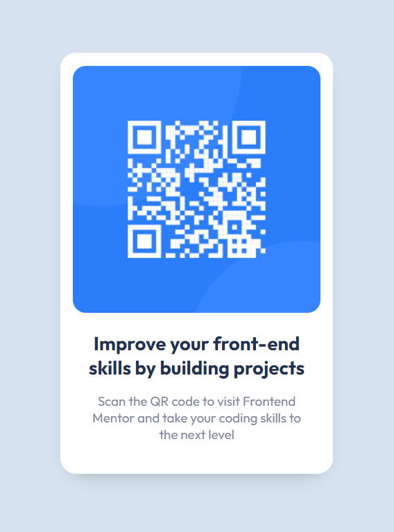

# Frontend Mentor - QR code component solution

This is a solution to the [QR code component challenge on Frontend Mentor](https://www.frontendmentor.io/challenges/qr-code-component-iux_sIO_H). Frontend Mentor challenges help you improve your coding skills by building realistic projects. 

## Table of contents

- [Overview](#overview)
  - [Screenshot](#screenshot)
  - [Links](#links)
- [My process](#my-process)
  - [Built with](#built-with)
  - [What I learned](#what-i-learned)
  - [Continued development](#continued-development)
  - [Useful resources](#useful-resources)
- [Author](#author)

## Overview

### Screenshot



### Links

- Solution URL: [GitHub](https://github.com/min4899/Frontend-Mentor-QR-Code-Component)
- Live Site URL: [GitHub Pages](https://min4899.github.io/Frontend-Mentor-QR-Code-Component/)

## My process

### Built with

- Semantic HTML5 markup
- CSS custom properties
- Flexbox

### What I learned

Custom properties are useful for not repeating code and creating color themes.

```css
:root {
  --white: #ffffff;
  --lightGrey: hsl(212, 45%, 89%);
  --grayishBlue: hsl(220, 15%, 55%);
  --darkBlue: hsl(218, 44%, 22%);
}
```
I learned that using a percent for font-size is better than px since percent can adjust to user preferences with different screen sizes and zoom.

```css
* {
  margin: 0;
  font-family: "Outfit";
  font-size: 93.75%; /* similar to 15px*/
}
```

### Continued development

I'd like to get more familiar with flex display and grid display for layouts in future projects. I've worked mostly with flex in the past in React Native, but I still don't fully understand how it works. Hopefully in future projects I'll understand how CSS layouts work.

### Useful resources

- ["The 6 most important CSS concepts for beginners" by Kevin Powell](https://youtu.be/JnTPd9G6hoY)
- ["5 simple tips to making responsive layouts the easy way" by Kevin Powell](https://youtu.be/VQraviuwbzU)

## Author

- GitHub - [Minwoo Soh](https://github.com/min4899)
- Frontend Mentor - [@min4899](https://www.frontendmentor.io/profile/min4899)

